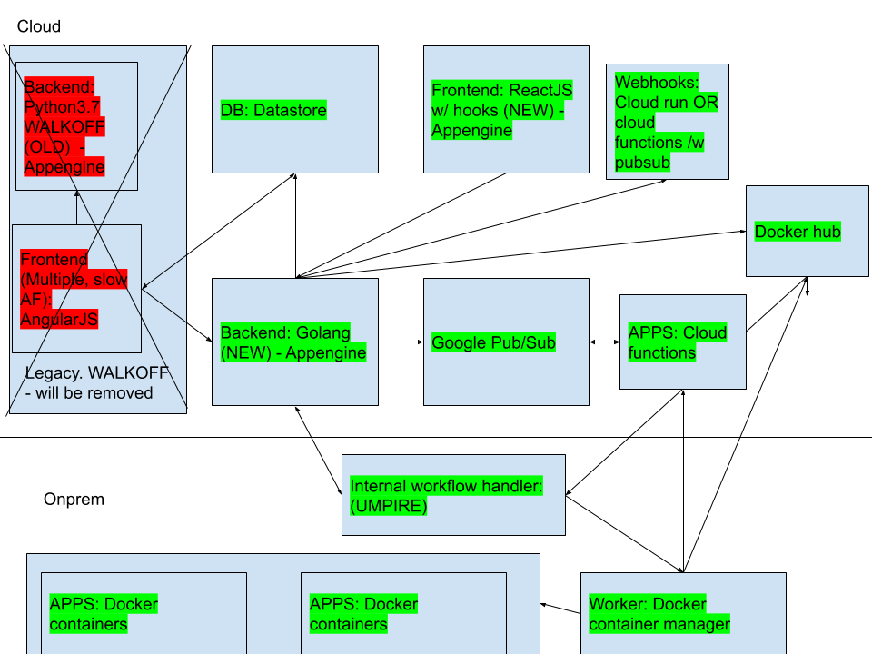

# Shuffle 
[Shuffle](https://shuffler.io) is an automation platform for your security stack. It leverages docker for scaling and OpenAPI for integrations. It has the possibility to run across multiple isolated environments, and gives you powerful tools to track progress.

## Try it
Check out the [installation guide](https://github.com/frikky/shuffle/blob/master/install-guide.md)

## Documentation
Documentation can be found on https://shuffler.io/docs/about or in your own instance. Currently lacking: 
* API documentation 
* Updates after migrating from SaaS to open source

## Features
* Premade workflows for Email, TheHive, C rtex MISP
* Premade apps for a number of security tools
* Simple workflow editor 
* App creator for [OpenAPI](https://github.com/frikky/OpenAPI-security-definitions)
* Easy to learn Python library for custom apps

## License
Shuffle is an open source and free software released under the AGPL (Affero General Public License). 

### Setup - Local
Frontend - requires [npm](https://nodejs.org/en/download/)/[yarn](https://yarnpkg.com/lang/en/docs/install/#debian-stable)/your preferred manager. Runs independently from backend - edit frontend/src/App.yaml to change from localhost to prod setting.
```bash
cd frontend
npm i
npm start
```

Backend - API calls - requires [>=go1.13](https://golang.org/dl/) and [gcloud](https://cloud.google.com/sdk/install) 
```bash
cd backend/go-app
go build
sudo apt -y update && sudo apt -y upgrade && sudo apt install -y google-cloud-sdk-app-engine-python google-cloud-sdk-app-engine-python google-cloud-sdk-datastore-emulator google-cloud-sdk-app-engine-go 
go run *.go
```

### Project overview
Below is the folder structure with a short explanation
```bash
├── README.md				# :)
├── deploy.sh				# Simple oneliner script to build and deploy the code to gcloud
├── backend					# Contains directly backend related code. Go with sh tests
├── frontend				# Contains frontend code. ReactJS and cytoscape. Horrible code :)
├── app_gen					# Contains code generation projects for OpenAPI or PythonLib -> Shuffler app 
├── functions				# Contains google cloud function code mainly.
│   ├── apps				# Some of the existing apps, manually made mostly
│   ├── generated_apps		# Some of the autogenerated apps
│   ├── newworker			# The worker that handles a workflow as a google cloud function
│   ├── static_baseline.py	# Static code used by stitcher.go to generate code
│   ├── stitcher.go			# Attempts to stitch together an app and deploy it to cloud functions and (TBD: Docker hub)
│   └── triggers 			# Custom triggers used in https://shuffler.io/workflows
│   ├── onprem				# All code for onprem solutions (https://shuffler.io/docs/hybrid for short doc)  _mostly_ reflects google cloud. Should be deprecated somehow and use the same code.
├── openintegrationhub  	# Here to remind me that openintegrationhub is a thing
├── legacy					# Legacy README. Contains A LOT of useful information about what I found with WALKOFF
└── tmp 					# Some legacy code, not yet ready to be removed
```

# Architecture
A basic image of how everything fits together, including legacy (left side)


# Technology
GCP was chosen because why not use the best thingies. "Serverless" \o/
```bash
├── languages 
│   ├── Go 					# I like go, which is why go.
│   ├── Python3.7 			# 3.7 specifically because of f-strings and 2.7 deprecation in 2020
│   ├── Javascript 			# Frontend stuff. Uses ReactJS + Cytoscape for visualization
│   ├── sh/Bash				# Basic testing and some deployment stuff
├── gcloud					
│   ├── appengine  			# Hosting frontend and backend. Currently on a free plan which is nice :)
│   ├── cloud functions		# Runs the "apps", "triggers" and other things
│   ├── datastore 			# Database - TODO before live: Move to firebase
│   ├── storage				# Save datablobs and information before deployment
│   ├── pubsub				# Used to instantly run cloud functions
│   ├── scheduler 			# Schedules can be triggers
├── onprem					
│   ├── Docker				# Runs the same cloud functions. I didn't like the thought of proxies
```

# Current focus(es) AKA todo
1. Make workflows work 99%+ of the time. This is a challenge with onprem + cloud stuff. Cloud sometimes breaks currently because of workers
2. Add user run statistics (e.g. how many runs of each workflow, how many failures etc.)
3. X - Fix OpenAPI app generator
4. Fix error overview in workflows
5. X - Better GUI (improved, but not good)
6. Have default workflows

# How to Add a trigger / custom thing
1. Add it to TriggersView in AngularWorkflow.js
2. Add it to RightSideBar for trigger 

# Migration
There will be a major overhaul to the backend specifically. I'm currently moving and updating the following:
- Create dockerfiles and a single runscript
- * App creator - (Cloud function -> Docker)
- * Workflows 	- Run workflows locally
- * App list 		- IMPORT EXISTING APPS 
- * Dockerfiles - Load the ones that are in workflows with a new version 
- * Docker-compose- Frontend, backend, db & orborus 
- * Configuration - Write setup documentation - Did for docker
- Workflows 		- IMPORT DEFAULT WORKFLOWS - Create some towards e.g. TheHive & MISP.
- Documentation - General documentation /docs rewrite
- API doc				- 1. In Shuffle. 2. In e.g. python
- Remove orborus? Can deploy straight, but that would be weird.
- Add secret to orborus 
- Change workflow name
- Remove registration and add user screen
- Add external and internal hostname for orborus & worker

```
# 1. export DATASTORE_EMULATOR_HOST=0.0.0.0:8000
# 2. docker run -p 8000:8000 google/cloud-sdk gcloud beta emulators datastore start --project=shuffle --host-port 0.0.0.0:8000 --no-store-on-disk
```
* Mail: Use appengine and connect to sendmail

### Migration issues:
* Some workflows where items have multiple parents don't work.
* Fix dummy.json (GCP config) - bypass this somehow.
